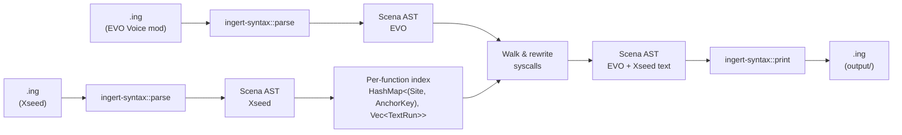
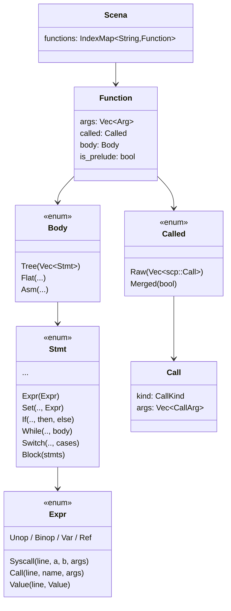
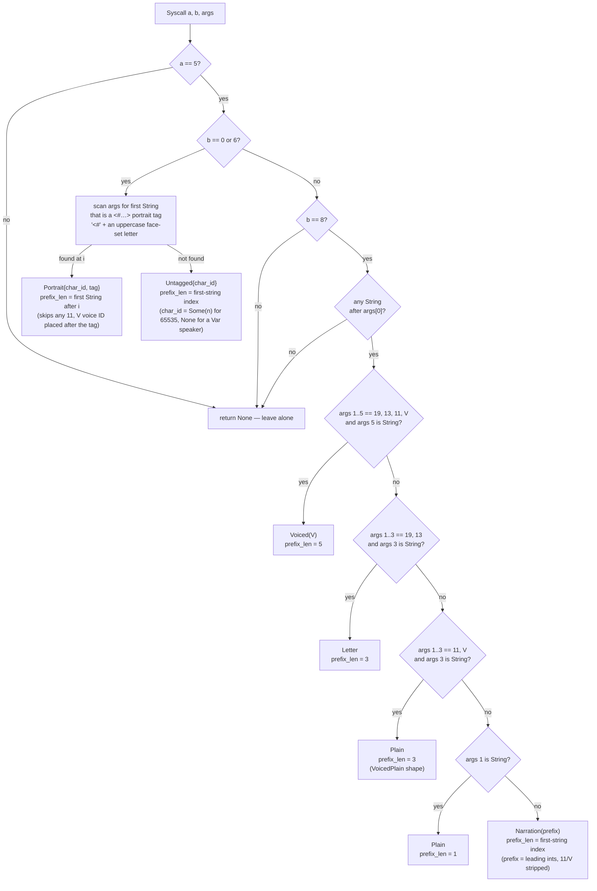
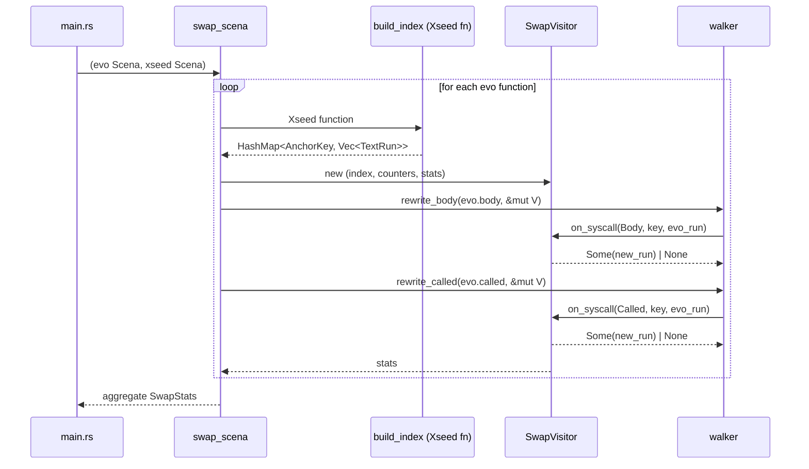
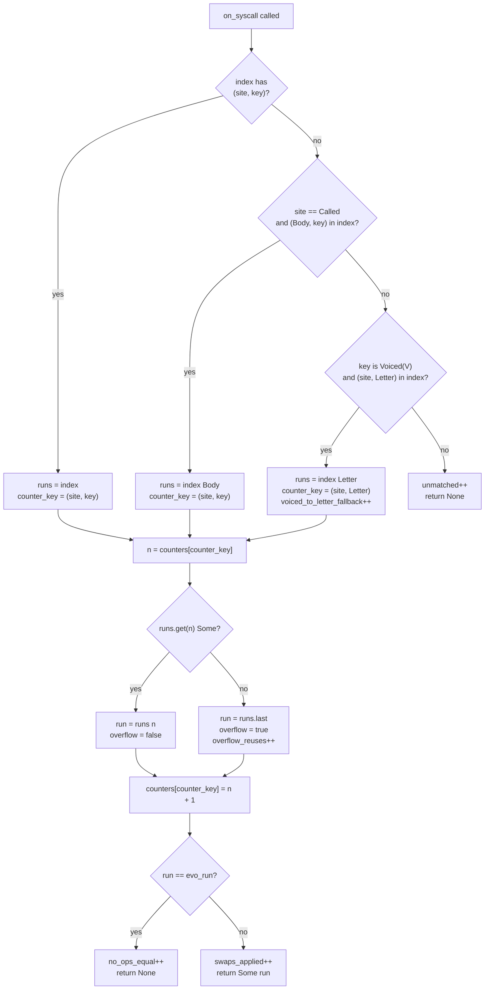

# Architecture

How `sora-remake-merge` rewrites EVO Voice mod `.ing` scripts to carry the Xseed English text. [`AGENTS.md`](../AGENTS.md) (the same content as `CLAUDE.md`) covers the merge *semantics*: anchors, voice IDs, duplication sources, and the N-to-M rule. This document covers the *implementation*.

## High-level summary

For anyone arriving here as a player rather than a contributor: this project combines two community mods for *Trails in the Sky: 1st Chapter*. The Xseed restoration overlay fixes the original English script (widely held to be the stronger localisation); the EVO Voice mod re-adds the voice-acted audio from the EVO edition. Each is strong where the other is weak. Xseed has the better text but no audio; EVO has the audio but ships the older, weaker GungHo translation. This repo combines them into one set of scripts that carry Xseed's text on top of EVO's voice hooks. Output lands under `output/`, and a separate Ingert step recompiles it to the binary `.dat` the game loads. For installation and the download, see [`README.md`](../README.md).

The merge runs in four stages, summarised here and detailed below.

1. **Parse.** The EVO `.ing` and its matching Xseed `.ing` are parsed into an AST by `ingert-syntax`. Working at the AST level rather than on raw text matters because dialogue calls interleave text with non-text arguments (character IDs, voice cues, portrait tags), and a regex would risk clobbering the very voice metadata the merge exists to preserve.
2. **Index.** For each Xseed function, an index maps a dialogue *anchor key* (broadly: who is speaking, with which portrait, and where relevant which voice line) to the localised text Xseed gives that anchor. The anchor is how an EVO line finds its Xseed counterpart. The index is partitioned by `Site` (body block vs. called-table metadata block), so the body walk and the called-table walk each run their own counter sequence.
3. **Walk and rewrite.** The EVO file is walked function by function. Each dialogue syscall is classified, its anchor looked up in the Xseed index, and on a match the EVO text is replaced with Xseed's. Voice IDs, character IDs, portrait tags, and other non-text arguments stay unchanged. AST-level cross-checks (`compare-original`, `compare-xseed`) confirm that EVO introduces no new dialogue lines relative to the GungHo decompile or to Xseed. EVO's only structural departures from `original/` are voice-ID upgrades on existing lines and one function whose body Ingert cannot decompile to a `Tree`; the swap layer handles both explicitly (see **Mod-specific divergences**).
4. **Print.** The transformed EVO AST is printed back to `.ing` under `output/`. The merge stops there: recompiling to `.dat` is a separate step (`scripts/ing2dat.py`, which calls Ingert). A directory run also writes an audit directory, `output/_audit/`, recording any unmatched calls, overflow reuses, or body substitutions.

The pipeline is idempotent: a second run against its own output is byte-identical, so re-running after a partial change is always safe. The sections below get into AST-specific terms, but the shape is always those four stages.

### Mod-specific divergences

What EVO actually changes relative to the GungHo decompile is narrow. Listing it up front makes the implementation choices below easier to read. The merge handles each category end-to-end.

1. **Voice-ID insertions on `[5,0]` and `[5,6]` portrait calls.** EVO inserts an `11, V` pair on many lines (for example, Joshua `60589` or Estelle `60593`). The pair usually sits between `char_id` and the portrait tag, but on a handful of lines it sits *after* the tag (`(2, "<#E…>", 11, 34731, …)`). The insertion never changes the anchor (the portrait tag is the key), so the `Portrait{char_id, tag}` lookup matches Xseed's voiced and unvoiced variants alike. The classifier advances `prefix_len` to the first string after the tag, so a trailing voice ID stays in the preserved prefix and EVO's `11, V` is kept verbatim.
2. **Anchor-shape upgrades on `[5,8]` calls.** EVO sometimes promotes a `[5,8]-letter` line to `[5,8]-voiced` (inserting `11, V` after the `19, 13` prefix), or a `[5,8]-plain` line to a `[5,8]-voiced-plain` variant (inserting `11, V` after the `65535` prefix). The upgrade changes which anchor the classifier returns, so a direct key lookup against Xseed (still on the unvoiced shape) fails. The classifier and swap visitor close the gap together: the classifier treats `[5,8]-voiced-plain` as `AnchorKey::Plain` (same anchor as the unvoiced shape, just a larger `prefix_len`) so it matches Xseed's `Plain` runs positionally, and the swap visitor falls back from `AnchorKey::Voiced(V)` to `AnchorKey::Letter` when the direct lookup is empty, sharing the per-site `Letter` counter so multiple upgraded `Voiced` calls advance through Xseed's `Letter` runs in source order. The voice IDs on this path in the current corpus are 97064 (VoicedPlain) and 97068 / 97069 (Letter→Voiced).
3. **`Body::Asm` functions.** Ingert's tree-mode decompiler can't always recover a `Body::Tree` from the bytecode. In the current corpus one EVO function (`mp3010_01.ing:QS300_01_00`) decompiles to `Body::Asm`, an opaque run of raw bytecode. The body walker only touches `Body::Tree`, so left alone that function would keep its GungHo text. The swap layer detects the (`EVO=Asm`, `Xseed=Tree`) case and clones Xseed's body into EVO outright, gated on `evo_calls_have_voice_ids` returning `false` (EVO added no voice IDs to the function, so the substitution loses nothing EVO-specific). It is logged to `output/_audit/body_substitutions.tsv`.

## Workspace layout

```
sora1stchapter/
├── Cargo.toml                 # workspace; pins ingert / ingert-syntax to a fork rev
├── rust-toolchain.toml        # nightly (ingert-syntax uses `never_type`)
├── resources/                 # read-only input corpora (.dat checked in; .ing gitignored)
│   ├── evo-voice-mod/         # merge target — EVO scripts (GungHo English + EVO audio)
│   ├── xseed-restoration/     # source of truth — Xseed English overlay
│   └── original/              # GungHo baseline (verification only)
├── output/                    # gitignored; merged .ing files land here
├── scripts/
│   ├── dat2ing.py             # batch `.dat` → `.ing` via ingert.exe (bootstrap)
│   ├── ing2dat.py             # batch `.ing` → `.dat` (post-merge)
│   └── prune.py               # drop corpus files with no Xseed counterpart
└── sora-remake-merge/
    ├── src/
    │   ├── lib.rs                       # public surface
    │   ├── main.rs                      # clap CLI, dir walking, file I/O, audit TSV writers
    │   ├── io.rs                        # parse_ing / print_ing wrappers
    │   ├── anchor.rs                    # AnchorKey + classify_syscall_{expr,call}
    │   ├── text_run.rs                  # extract / build / replace TextRun = Vec<TextChunk>
    │   ├── walker.rs                    # AST walker + Visitor trait (body and called)
    │   ├── swap.rs                      # swap_scena, per-(Site, AnchorKey) index, SwapVisitor
    │   ├── verify.rs                    # localization-delta invariant check (verify_scena)
    │   └── bin/
    │       ├── compare-original.rs      # EVO body vs `resources/original/` AST diff
    │       ├── compare-xseed.rs         # EVO body vs `resources/xseed-restoration/` AST diff
    │       └── verify-delta.rs          # full-corpus localization-delta invariant check
    └── tests/e2e.rs                     # roundtrip / corpus-based integration tests
```

The merge crate exposes a library plus four binaries: `sora-remake-merge` (the merge tool itself) and the three read-only analysis binaries under `src/bin/`. Integration tests drive `swap_scena` and `verify_scena` directly through the library surface without spawning a separate process.

## High-level data flow



The pipeline is a pure AST transformation: no regex, no string patching, no fuzzy matching. Only the parser and printer from the [`ingert-sora1` fork](https://github.com/kvnxiao/ingert-sora1) need to know the surface syntax.

## Why an AST pipeline (and why Rust)

Two factors make a regex-based approach a non-starter.

- **Voice IDs are integer arguments mixed in with text arguments.** In `system[5,0](134, 11, 33247, "<#E…>", "text")`, the `11, 33247` pair is positional, not labelled. A textual rewrite would have to count commas correctly across both EVO-original voice IDs (e.g. Lugran `33247`) and EVO-added ones (e.g. Joshua `60589`). The AST gives typed `Expr::Value(_, Value::Int(_))` vs. `Expr::Value(_, Value::String(_))` distinctions for free.
- **Text spans multiple string arguments.** EVO and Xseed split long lines differently (`"X"` vs. `"X", 10, "Y"`). The swap has to replace the *entire trailing string run* as a unit, not align string-for-string.

Rust pays off here: the parser and printer already exist as a library, the typed AST makes it hard to clobber a voice ID by accident (`Vec<Expr>` indexing is typed), and the parse → transform → print cycle is naturally idempotent.

## The `.ing` AST in one picture



Two parallel argument families carry text:

- `Body::Tree(Vec<Stmt>)` is where runtime control flow lives. Dialogue calls appear as `Expr::Syscall(_, 5, 0|6|8, Vec<Expr>)`.
- `Called::Raw(Vec<Call>)` is the called-table metadata block (the first `{ }` after `calls`). Dialogue calls appear as `Call { kind: CallKind::Syscall(5, 0|6|8), args: Vec<CallArg> }`.

The two are structurally equivalent for our purposes (same opcode space, same argument layout), though built from different ingert types (`scena::Value` vs. `scp::Value`). The merge walks both with identical logic.

Because `dat2ing.py` always runs `ingert.exe --mode tree`, the `Body::Flat` and `Body::Asm` variants and `Called::Merged` are corner cases the swap layer handles defensively. They're rare but not absent: `mp3010_01.ing:QS300_01_00` decompiles to `Body::Asm`, and the swap layer compensates by cloning Xseed's `Body::Tree` in its place (see **`Called::Merged` and non-`Tree` bodies** below).

## Module responsibilities

### `anchor.rs`: opcode → key

`classify_syscall_expr` and `classify_syscall_call` are mirror functions, both delegating to a generic implementation parameterised over `as_int`, `as_string`, and `is_string` closures. Each returns an `Option<Classification>`:

```rust
pub enum AnchorKey {
    Portrait { char_id: i32, tag: String },   // [5,0] and [5,6] with a <#…> portrait
    Untagged { char_id: Option<i32> },         // [5,0]/[5,6] with no portrait — positional, bucketed by char_id
    Voiced(i32),                               // [5,8]-voiced — strongest anchor
    Letter,                                    // [5,8]-letter — positional within fn
    Plain,                                     // [5,8]-plain  — positional within fn
    Narration(Vec<i32>),                       // [5,8] integer-prefix narration — positional per prefix
    MapName,                                   // ui_mapname_effect (system[22,38]) — positional
    MenuItem,                                  // menu_additem — positional (records-terminal headers)
    DisplayName { char_id: i32 },              // chr_set_display_name — positional per (fn, char_id)
}

pub struct Classification {
    pub key: AnchorKey,
    pub prefix_len: usize,        // args[..prefix_len] is the immutable prefix
    pub run_len: Option<usize>,   // run length; None = run to end (dialogue), Some(n) = exactly n args (narration terminator, map-name coords, menu index)
}
```

The classifier returns `None` for unsupported opcodes, named-function calls, `[5,8]-params` (the no-string variant), and `[5,8]` parameterised messages whose text is split around a value placeholder. Every caller treats `None` as "leave the call alone".



For `[5,0]` and `[5,6]`, the classifier first scans for a `<#…>` portrait tag, recognised as `<#` followed by an uppercase face-set letter (`E`, `L`, …), which tells a real portrait apart from an in-text control code like `<#123I>`. With a tag, the key is `Portrait{char_id, tag}` and `prefix_len` advances to the first string **after** the tag. That matters because a few lines place the `11, V` voice ID after the portrait (`(2, "<#E…>", 11, 34731, "text")`) rather than before it, and skipping to the first trailing string keeps that voice ID in the preserved prefix. With no portrait tag the call is narrator/system text or a variable-speaker line, so it falls back to `AnchorKey::Untagged{char_id}`: there is no per-call key, so these match positionally, bucketed by `char_id` (`Some(n)` for an integer channel, typically `65535`, e.g. examine descriptions and `<C1>` story-recap screens; `None` for a `Var` speaker, e.g. internal monologue). Any leading voice-ID prefix again sits in the preserved prefix, untouched.

The `[5,8]-voiced-plain` branch (`args[1..3] == 11, V`) emits the **same** `AnchorKey::Plain` as the regular Plain shape, but with `prefix_len = 3` instead of `1`. That lets EVO's voiced song lyrics anchor positionally against Xseed's existing `Plain` runs while keeping the `11, V` voice marker out of the text run during the swap.

The final `[5,8]` branch, `AnchorKey::Narration`, is the catch-all for narration whose integer prefix matches none of the shapes above: signposts (`65535, 13, …`), device/terminal UIs (`65535, 26, 13, …`), and records/encyclopedia entries (`65535, 26, 22, …` and `65535, 16, 26, 22, …`). `prefix_len` is the index of the first string, and the wrapped `Vec<i32>` is the integer prefix with any EVO-inserted `11, V` voice marker removed. So EVO's voiced narration (e.g. the fortune-teller's `26, 13, 11, V`) buckets with Xseed's unvoiced `26, 13`, while the voice marker survives in the preserved prefix. Each distinct prefix gets its own positional counter.

Unlike the dialogue and map-name shapes, the `[5,8]` classifier computes an explicit `run_len`: the contiguous string/`Int(10)` span from `prefix_len`. Trailing non-text arguments (notably the `13` record terminator on encyclopedia entries) fall outside the run and are preserved verbatim. If a string appears **after** that contiguous span, the call is a parameterised message such as `(65535, 16, "Received ", 17, n, ".")` whose text is split around a runtime value; the classifier returns `None` and leaves it untouched, since it can't be localised as a single trailing run.

`prefix_len` is all the swap layer needs to know about the prefix. Everything before it is untouchable; everything from it up to `prefix_len + run_len` is the text run; anything after is a preserved tail.

### `text_run.rs`: `TextRun` ↔ args

```rust
pub enum TextChunk {
    Str(String),
    Newline,
}

pub type TextRun = Vec<TextChunk>;
```

A `TextRun` is a sequence of `Str` and `Newline` chunks rather than a `Vec<String>`. The old `Vec<String>` assumed `Int(10)` newlines strictly alternated with strings, which broke on the legal, observed shape where two `String` arguments sit back-to-back with no `10` between them. Storing the chunk sequence verbatim drops that assumption, which is what cleared the last of the overflow-audit cases.

Three operations are defined, each implemented twice (an Expr flavour and a CallArg flavour):

- `extract_run_{expr,call}(&[…]) -> Option<TextRun>`: peels off any sequence of `String` and `Int(10)` arguments. It returns `None` on a non-text shape, the caller's signal to leave the call alone. Line annotations on string arguments are dropped.
- `build_run_{expr,call}(&TextRun) -> Vec<…>`: the inverse. It emits one argument per chunk (no implicit newline insertion) and **never** stamps `Line` annotations on the new arguments, so injected Xseed strings come out clean.
- `replace_run_{expr,call}(&mut Vec<…>, prefix_len, &new_run)`: truncates the argument list after the prefix and appends the rebuilt run.

The asymmetry between extract (drops annotations) and build (never adds them) is deliberate: it's what guarantees idempotency, so parse → transform → print → parse → transform yields the same AST.

### `walker.rs`: AST traversal and the `Visitor` trait

```rust
pub enum Site { Body, Called }

pub trait Visitor {
    fn on_syscall(
        &mut self,
        site: Site,
        line: Option<u16>,
        key: &AnchorKey,
        evo_run: &TextRun,
    ) -> Option<TextRun>;  // Some(new) → swap; None → leave alone
}

pub fn rewrite_body(stmts: &mut [Stmt], visitor: &mut impl Visitor);
pub fn rewrite_called(calls: &mut [Call], visitor: &mut impl Visitor);
```

The `line` parameter carries the source-line annotation on the syscall expression (where present), so audit entries from `SwapVisitor` can point back at the EVO line that triggered them. `rewrite_called` passes `None`, since called-table entries carry no per-call line annotation in the AST.

`rewrite_body` recurses through every `Stmt` variant that can hold expressions: both branches of `If`, every `Switch` arm, nested `Block`s, `While` bodies, the RHS of `Set`, the payloads of `Return` and `PushVar`, and the argument lists of `Debug` and `Tailcall`. Each `Expr::Syscall` is classified, its trailing run extracted, and the visitor asked whether to swap. `Some(new)` triggers `args.truncate(prefix_len); args.extend(build_run_expr(&new))`.

`rewrite_called` walks `Called::Raw` calls in order, applying the same logic to `CallArg` values.

The visitor is the seam between *walking* and *swapping*. Tests run the walker against a counting visitor; production wires in `SwapVisitor`.

### `swap.rs`: the index and `SwapVisitor`

`swap_scena` is the public entry point. It iterates over EVO functions, looks up each by name in the Xseed `Scena`, builds an index from that Xseed function, and runs the visitor over EVO's body and called-table.

```rust
type Index = HashMap<(Site, AnchorKey), Vec<TextRun>>;
```

The index is built **per function, not per file**, and **partitioned by `Site`**, with separate entries for runs from Xseed's `Body` walk and its `Called` walk. Anchors only collide within one function (the same character with the same portrait), so a per-function map is enough. The `Site` partition also avoids cross-block aliasing, where a body-only call could otherwise pick up text from a similar called-only call elsewhere in the same function. An earlier non-partitioned variant caused unmatched-but-coincidentally-correct results in `LP_CHECKED_BOARD`; the partitioned version fixes them.



#### Lookup, fallbacks, and N-to-M matching

The same anchor key often appears several times in a function, both from `calls{} {}` duplication and from first-visit/revisit branches in the body. So the lookup has three stages. First, a direct hit on `(site, key)`. If that misses and the call is in the called-table, it retries against `(Body, key)`, covering the case where the metadata block's shape differs slightly from the body. If that also misses and the call is a `[5,8]-voiced` shape, it retries against `AnchorKey::Letter`, the EVO Letter→Voiced upgrade path. Once a run-list is chosen, a per-`(site, counter_key)` counter walks it positionally, as in the flowchart below.



Counters are partitioned by `Site` so the called-table walk and the body walk each get a fresh sequence; the metadata duplicates the body, so the two consume the same Xseed runs in the same order. The Voiced→Letter fallback shares the per-site `Letter` counter, so *multiple* EVO Letter→Voiced upgrades in one function advance through Xseed's `Letter` runs in source order. `mp1010_04.ing:EV_01_61_00` exercises this directly.

The overflow rule (reuse the last Xseed run when EVO has more occurrences than Xseed for an anchor) is the deliberate concession to the calls/body × first-visit/revisit multiplicity from `AGENTS.md`. It's looser than a strict one-to-one mapping, but it handles the duplication patterns seen across the corpus, and the latest run records no overflow reuses at all.

#### `Called::Merged` and non-`Tree` bodies

- `Called::Merged(_)`: the called-table is `dup`-equivalent to the body. The body walk has already covered it, so the swap layer skips the called walk in this case.
- `Body::Flat(_)` and `Body::Asm(_)` paired with `Xseed=Tree`: the body walker only touches `Body::Tree`, so a non-`Tree` EVO body would otherwise leave that function's runtime text untouched. The swap layer detects the (`EVO=Asm|Flat`, `Xseed=Tree`) case and substitutes Xseed's body wholesale, gated on `evo_calls_have_voice_ids` returning `false`. The gate inspects EVO's calls-table and counts the function as "EVO added voice IDs" if any call carries an explicit `11, V` marker anywhere in its preserved prefix: before or after the portrait tag for `Portrait` calls, and anywhere in the integer prefix for `Untagged` and `Narration` calls. Checking `prefix_len > N` alone isn't enough, because some `[5,0]` calls carry extra integer parameters between `char_id` and the portrait tag (e.g. `system[5,0](11510, 25, "<#E…>", …)`) that aren't voice IDs. The substitution is logged to `output/_audit/body_substitutions.tsv`. `mp3010_01.ing:QS300_01_00` exercises this path.

### `io.rs`: parser and printer adapters

Thin wrappers over `ingert_syntax::{lex, parse, print}`. `parse_ing` aggregates `Errors` at `Error` severity or worse into a `ParseError` with line-resolved messages. `print_ing` is `ingert_syntax::print::print` re-exported.

The workspace pins a fork revision mainly because **the upstream Ingert printer wasn't stable on these inputs** (specifically `mp0010_05.ing`). The integration tests pin both behaviours:

- `evo_mp1010_04_roundtrip_stable` and `evo_mp0010_05_roundtrip_stable`: assert that `print(parse(s)) == print(parse(print(parse(s))))`.
- `mp0010_05_output_recompiles_via_ingert`: verifies that, after a swap, `ingert.exe` accepts the printed `.ing` back as input.

Should the printer regress, the fix should be applied in the [`ingert-sora1` fork](https://github.com/kvnxiao/ingert-sora1), pushed, and the `rev` field bumped in the workspace `Cargo.toml`. The fork remote (`fork → git@github.com:kvnxiao/ingert-sora1.git`) lives at `C:/Users/kvnxiao/github/Ingert/`.

### `main.rs`: the CLI

```
sora-remake-merge                                       # defaults to resources/* + output/
sora-remake-merge --evo <path> --xseed <path>           # file or dir
sora-remake-merge --out <path>                          # override output destination
sora-remake-merge --dry-run                             # parse + compute, no writes
sora-remake-merge --verbose                             # per-file swap counts
```

Directory mode walks `--evo` recursively with `walkdir`, filters to `.ing`, mirrors the relative path under `--xseed` and `--out`, and aggregates per-file `SwapStats`. EVO files with no Xseed counterpart are skipped (counted under `files_missing_xseed_skipped`). The tool never mutates inputs.

After a directory run, `main.rs` also writes audit TSVs under `<out>/_audit/`: `unmatched.tsv` (EVO calls with no Xseed anchor, empty on a clean run), `overflow.tsv` (EVO occurrences beyond Xseed's run count for an anchor, where the last Xseed run is reused, also empty on a clean run), and `body_substitutions.tsv` (functions whose non-`Tree` EVO body was replaced by Xseed's `Tree` body, which records the one substitution on a clean run). The summary line also reports the `voiced→letter fallbacks` and `body substitutions` counters.

## Supported opcodes (reference table)

| Opcode | Shape | Anchor | Prefix |
|---|---|---|---|
| `[5,0]` | `(char_id, [voice_ids…], "<#E…>", [voice_ids…,] ["<K>" \| "<k>",] strings…)` | `Portrait{char_id, tag}` | through the first string after the `<#E…>` arg (skips a `11, V` placed after the tag) |
| `[5,6]` | same as `[5,0]` (voiced/continuation variant) | `Portrait{char_id, tag}` | through the first string after the `<#E…>` arg |
| `[5,0]`/`[5,6]`-untagged | `(65535 \| var, [voice_ids…], strings…)` — narrator/system text or a variable speaker, **no** `<#…>` portrait | `Untagged{char_id}` (positional, bucketed by `char_id`: `Some(n)` for an int channel, `None` for a `Var`) | through any leading ints/voice IDs |
| `[5,8]-voiced` | `(65535, 19, 13, 11, V, strings…)` | `Voiced(V)` | through `11, V` |
| `[5,8]-letter` | `(65535, 19, 13, strings…)` | `Letter` (positional) | through `19, 13` |
| `[5,8]-voiced-plain` | `(65535, 11, V, strings…)` — EVO upgrade of a Plain line with a voice ID | `Plain` (positional, same anchor as the unvoiced shape) | through `11, V` |
| `[5,8]-plain` | `(65535, strings…)` | `Plain` (positional) | through `char_id` |
| `[5,8]-narration` | `(65535, <int prefix>, strings…[, 13])` — signposts (`13`), device UIs (`26, 13`), records (`26, 22` / `16, 26, 22`); EVO may add `11, V` | `Narration(prefix)` (positional per prefix; `11, V` stripped from the bucket key) | through the last prefix int (first-string index) |
| `[5,8]-params` | `(65535, 16, …, 17, …, …)` — no strings | — | skipped |
| `[5,8]-parameterised` | `(65535, 16, "x", 17, n, "y")` — text split around a value placeholder | — | skipped |
| `ui_mapname_effect` (`[22,38]`) | `("text", x, y, scale)` — named prelude alias, not a raw syscall | `MapName` (positional) | leading string only; trailing coords preserved |
| `menu_additem` | `(char_id, "text", index)` — named prelude alias, not a raw syscall | `MenuItem` (positional) | label string only; trailing index preserved |
| `chr_set_display_name` | `(char_id, "name")` — named prelude alias; speaker label | `DisplayName{char_id}` (positional per `(fn, char_id)`; int `char_id` only, `Var` skipped) | name string only |
| anything else | — | — | skipped |

`Voiced` is the only `[5,8]` key with a uniquely identifying anchor; `Letter` and `Plain` rely on counter-based position-matching within the function. The `[5,8]-voiced-plain` shape emits the same `AnchorKey::Plain` as the unvoiced shape (with a larger `prefix_len`), so EVO's voiced song lyrics anchor positionally against Xseed's existing `Plain` runs while the `11, V` marker survives the swap. The `[5,8]-voiced` IDs are stable across `original/`, `xseed-restoration/`, and `evo-voice-mod/`; EVO inserts voice IDs on three lines that the original and Xseed leave unvoiced: 97064 (VoicedPlain) and 97068 / 97069 (Letter→Voiced).

## Idempotency

A second invocation on the output of the first is a byte-identical no-op. Three behaviours enforce this property:

1. `extract_run_*` drops `Line` annotations and `build_run_*` never adds them, so an already-rewritten string run extracts identically to the index entry.
2. `on_syscall` compares `run == evo_run` and returns `None` on equality, leaving the AST unchanged when the text already matches.
3. The walker only rewrites `args` when the visitor returns `Some(new_run)`. No `Some(_)` means no `Vec::truncate`, hence no AST churn.

These behaviours are covered by `swap::tests::idempotent_second_run_is_noop` and the e2e `idempotent_mp{0010_05,1010_04}` tests.

## Test surface

Unit tests live next to each module (`#[cfg(test)] mod tests`). Integration tests in `tests/e2e.rs` drive the library entry point against real corpus files. The full suite passes.

- **Parser/printer roundtrip stability** on `mp1010_04.ing`, `mp0010_05.ing`, and `mp3010_01.ing` (both EVO and Xseed in each case).
- **The three documented `mp1010_04.ing` examples**: Lugran "Yes, from Aina" → Xseed wording, Joshua jurisdictional disputes, and Estelle General Morgan. Each test asserts that the Xseed text is present, the EVO text is absent, and the EVO voice IDs (`33247`, `60589`, `60593`) survive.
- **Cassius letter `[5,8]-voiced`**: voice IDs `34832..=34844` survive verbatim, and Xseed's quoted style replaces EVO's.
- **Letter→Voiced fallback**: `mp1010_04.ing:EV_01_61_00` upgrades two unvoiced letter lines to voiced (IDs `97068` and `97069`); the test asserts the voice IDs survive and Xseed's letter wording is applied.
- **Plain→VoicedPlain shape**: `mp3010_01.ing:QS308_01_00` upgrades an unvoiced song lyric into a voiced one (ID `97064`); the test asserts the voice ID survives and that Xseed's lyric replaces the GungHo wording.
- **`Body::Asm` substitution**: `mp3010_01.ing:QS300_01_00`. The test asserts that the body-substitution counter increments to one, that the printed output no longer contains an `asm { … }` block, and (with the recompile test below) that the substituted `Tree` body recompiles back to `.dat`.
- **`[5,8]` narration**: `mp3010_01.ing`'s orbal-records terminal (`65535, 26, 22, …` / `65535, 16, 26, 22, …`) is localised to Xseed v1.7's records text while the integer prefix and `13` terminator survive. Unit tests additionally cover signpost/device/records classification, the EVO `11, V` voice-marker stripping from the bucket key, the trailing-terminator run length, and the parameterised-message skip (`(65535, 16, "Received ", 17, n, ".")` is left byte-identical).
- **Portrait-less `[5,0]`/`[5,6]` (`Untagged`)**: `mp1110.ing`'s narrator lines (`system[5,6](65535, "<C1>…")` in `EV_01_53_00` / `EV_01_55_00` / `EV_01_56_00` / `SB_01_01_00`) are re-translated by Xseed; the test asserts every EVO copy swaps to the Xseed wording. Unit tests additionally cover the positional swap with `char_id` preserved and the `Var`-speaker bucket (`Untagged{None}`) whose voice ID survives.
- **Voice-ID-after-portrait**: `mp1110.ing:EV_01_60_00`'s Bose line carries `11, 34731` *after* the portrait tag; the test asserts Xseed's text replaces EVO's and that the voice ID stays adjacent to the portrait in the preserved prefix.
- **`menu_additem` records-terminal headers**: `mp3010_01.ing:LP_Capel`'s Zeiss orbal-records topic menu (`<c930>[…]` headers via the `menu_additem` named alias) is localised to Xseed v1.7's wording (e.g. `[History]` → `[Establishment]`, `[Orbment]` → `[Orbments]`) while the `char_id` and trailing menu-index args survive. Unit tests cover the classifier (label is arg 1, index preserved) and the positional swap.
- **`chr_set_display_name` speaker labels**: combined-party labels are rephrased to Xseed's wording, keeping the `char_id`: `mp0000_ev.ing`'s "Lonnie, Dino, & Lyle" → "Lonnie, Dino & Lyle" (char_ids 10066/10068) and `mp4000_ev.ing`'s "Scherazard, Kloe, & Estelle" → "…, and Estelle" (char_id 0). Unit tests cover the int-`char_id`-only classification (a `Var` slot is skipped) and that matching is keyed by `char_id`, not raw position.
- **Inline `<C2>…</C>` colour markup**: Xseed v1.7's markup on `mp0010_05.ing` rides through the swap verbatim as opaque string content.
- **Localization-delta invariant**: `mp1010_04.ing` (the one fixture present in all three corpora) is run through `verify_scena`; the test asserts no violations, that the merge did substantial work, and that the only anchor-shape exemption is the `EV_01_61_00` Letter→Voiced upgrade (voice IDs `97068` / `97069`). The full-corpus counterpart is the `verify-delta` binary.
- **Idempotency at file level** on `mp1010_04.ing`, `mp0010_05.ing`, and `mp3010_01.ing`.
- **`resources/` read-only invariant**: both Xseed and `original/` files are verified to hash identically before and after a swap.
- **`ingert.exe` recompile**: the `.ing` output from a swap recompiles back to `.dat` via the fork's binary on `mp1010_04`, `mp0010_05`, and `mp3010_01` (the last exercising the substituted `Tree` body). These tests are gated on the `INGERT_EXE` environment variable and catch any printer-versus-compiler drift introduced by the fork or by a substitution.

The recompile and roundtrip tests assume that the `.ing` fixtures have been regenerated (the `.ing` files are gitignored, while only `.dat` is checked in). Running `python scripts/dat2ing.py resources/<corpus>` bootstraps them.

## Analysis binaries

Besides the merge binary, three read-only analysis tools live under `sora-remake-merge/src/bin/`. All reuse the merge's classifier and walker, so the anchor distributions and deltas they report are exactly those the merge consumes.

The two `compare-*` binaries count every localizable call in the EVO body and break it down by anchor kind. This covers both the raw dialogue syscalls (`Portrait`, `Untagged`, `Voiced`, `Letter`, `Plain`, `Narration`) and the named prelude-alias calls (`MapName`, `MenuItem`, `DisplayName`); the named aliases are classified through the same `classify_named_call_expr` the swap uses. (Like the dialogue syscalls, only the `Body::Tree` body is counted, not the called-table metadata.)

- **`compare-original`** (`just compare-original`): walks every EVO body alongside the matching `resources/original/` body and reports any function with a count diff or an anchor-distribution diff. A clean run reports `Net syscall diff EVO-orig: +0`, `Functions w/ count diff: 0`, and a single anchor diff at `mp1010_04.ing:EV_01_61_00` (the Letter→Voiced upgrades, same total, re-anchored), with the `Body::Asm` function `mp3010_01.ing:QS300_01_00` skipped. The named-alias counts match between EVO and `original/` everywhere, so they add no new diffs. This is the binary that established that EVO adds no new dialogue lines.
- **`compare-xseed`** (`just compare-xseed`): the symmetric check against `resources/xseed-restoration/`. A clean run shows the same `EV_01_61_00` anchor diff and the skipped `Body::Asm` function, plus a Xseed authoring artefact in `mp2000_ev.ing:EV_03_00_00`, where byte-identical Portrait calls for voice ID `40012` appear back-to-back in Xseed but only once in either EVO or `original/` (a `Portrait` count diff of `+1`, with the `DisplayName` counts in that function matching exactly). The merge maps the live occurrence and drops the duplicate, so no real content is lost.
- **`verify-delta`** (`just verify-delta`): the end-to-end localization-delta check described under **`verify.rs`** below. It runs the merge across every EVO/Xseed/`original` triple and asserts that the merged output differs from EVO exactly where Xseed differs from `original/`, carrying Xseed's text wherever it differs. A clean run reports `Violations: 0` and lists exactly the two documented exemptions: the `EV_01_61_00` anchor-shape upgrades and the `QS300_01_00` body substitution.

The `compare-*` tools check the AST *shape* (counts and anchor kinds line up); `verify-delta` checks the *text* (the merge applied Xseed's changes and only those). The audit TSVs written by the merge itself (`output/_audit/{unmatched,overflow,body_substitutions}.tsv`) cover the merge's runtime view. Together they make the claim that "EVO introduces no new dialogue lines, and the merge applies exactly Xseed's text" checkable from independent angles.

### `verify.rs`: the localization-delta invariant

`verify_scena(evo, xseed, original)` proves the merge applied *exactly* Xseed's text changes and nothing else. The invariant, per localizable call, is:

> `(output_text != evo_text)` ⟺ `(xseed_text != original_text)`, and where they differ, `output_text == xseed_text`.

This holds because the EVO Voice mod ships the GungHo text verbatim (EVO text equals `original/` text on every shared line), so the merge's "swap iff the runs differ" rule coincides with Xseed's own localization delta against `original/`, and a positional match is sound.

The check clones EVO, runs `swap_scena`, then builds the swap's own per-`(Site, AnchorKey)` index ([`build_index`]) for all four corpora (EVO input, merged output, Xseed, and `original/`), so the occurrence ordering it compares is exactly the ordering the merge consumes. For each EVO bucket it resolves the matching Xseed/`original` run-list with the swap's first two lookup stages (a direct `(site, key)` hit, then `(Body, key)` when the EVO bucket is in the called-table, since EVO adds the `calls {}` metadata blocks that Xseed/`original` lack), then per occurrence asserts three things: the output run equals the Xseed run the merge selected (`Content`), the EVO run equals the `original/` run (`Overlay`, the overlay assumption), and the merge changed the occurrence iff Xseed localized it (`Delta`). Two configurations are recorded as exemptions rather than violations, because a dedicated swap mechanism (covered by its own tests) handles them: EVO anchor-shape upgrades, whose upgraded `AnchorKey` has no direct Xseed counterpart and reach Xseed's text through the Voiced→Letter fallback (`mp1010_04.ing:EV_01_61_00`), and `Body::Asm`/`Body::Flat` body substitutions, where the EVO input has no `Tree` occurrences to diff against (`mp3010_01.ing:QS300_01_00`).

## Workflow summary

1. `python scripts/dat2ing.py resources/{evo-voice-mod,xseed-restoration,original}`: bootstrap the `.ing` fixtures.
2. `cargo run --release -- --verbose`: run the merge against the defaults, with output landing in `output/`.
3. `python scripts/ing2dat.py output/script_en/scena`: recompile to game-loadable `.dat`.

The merge tool stops at step 2. Recompilation is intentionally a separate Ingert invocation.

## Out of scope

- Recompiling `.ing` → `.dat` (handled by `ingert.exe` and `scripts/ing2dat.py`).
- Fuzzy text matching, or any heuristic beyond exact `AnchorKey` equality. Unmatched calls stay byte-identical.
- Interactive prompts, partial-merge modes, or any UI. The tool runs once and either succeeds or fails loudly.
- Opcodes beyond `[5,0]`, `[5,6]`, and `[5,8]`. A new localised opcode would mean extending the classifier and tests together.
