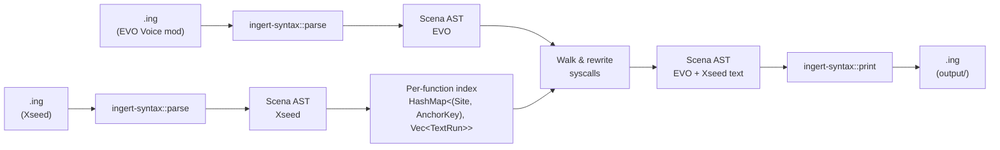
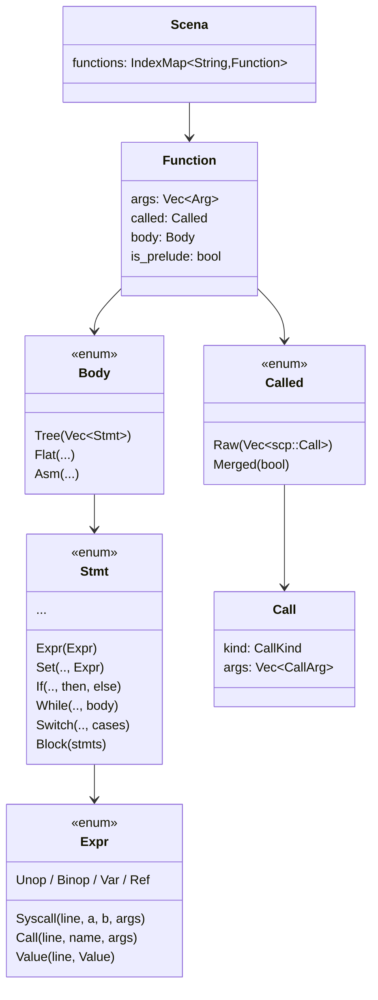
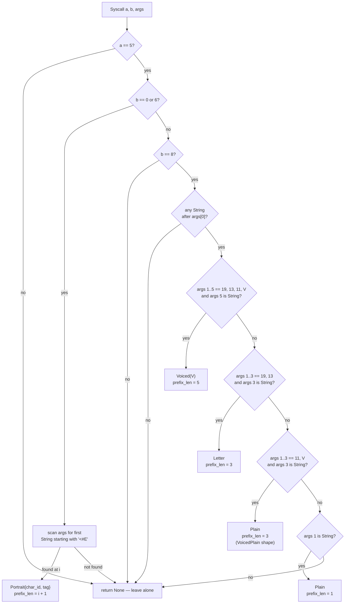
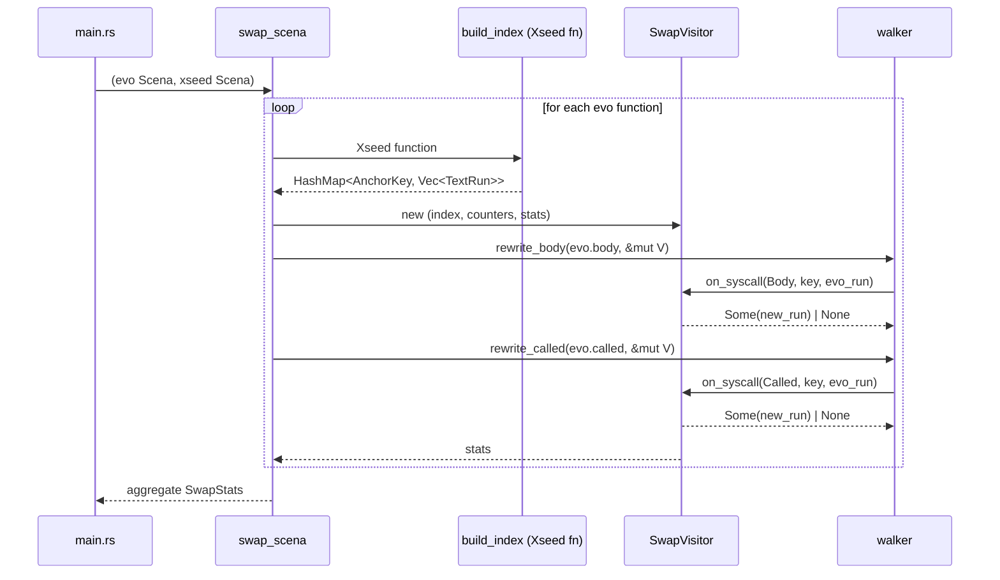
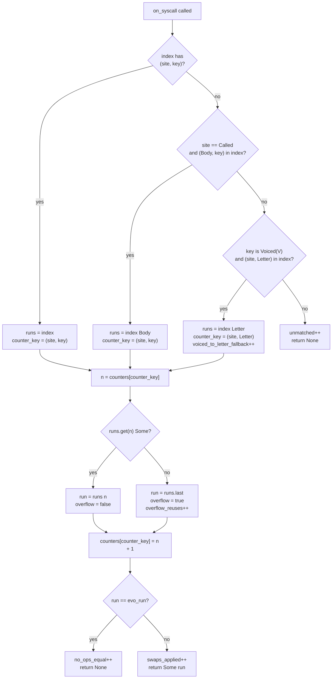

# Architecture

This document describes how `sora-remake-merge` rewrites EVO Voice mod `.ing` scripts to carry the Xseed English text. Before reading further, it is worth consulting [`AGENTS.md`](../AGENTS.md) (equivalent to `CLAUDE.md`), which covers the merge semantics: anchors, voice IDs, duplication sources, and the N-to-M rule. The present document describes the implementation that realises those semantics.

## High-level summary

For visitors who have arrived at this repository as players rather than as contributors, the short version is that this project produces a community mod which combines two existing community efforts for *Trails in the Sky: 1st Chapter*. The Xseed restoration overlay corrects the original English script, which is widely regarded as the stronger localisation, while the EVO Voice mod re-adds the voice-acted audio from the EVO edition of the game. Each project is strong in one dimension and weak in the other: Xseed has the better text but no added audio, whereas the EVO Voice mod has the audio but ships with the older, weaker GungHo translation. The role of this repository is consequently to combine the two, producing a single set of script files which carry Xseed's text on top of the EVO mod's voice hooks. Finished output lands under `output/`, and a separate Ingert step subsequently recompiles those files back to the binary `.dat` format that the game can load. For installation instructions and the download itself, see the project [`README.md`](../README.md).

The merge itself is implemented as a deliberate sequence of four stages, summarised here and elaborated in the sections that follow.

1. **Parse.** Both the EVO `.ing` script and the corresponding Xseed `.ing` script are parsed into an abstract syntax tree by the `ingert-syntax` library. Working at the AST level, rather than at the level of raw text, is essential because dialogue calls interleave text with non-text arguments (character IDs, voice cues, portrait tags), and a regex-based approach would consequently risk clobbering the very voice metadata which the merge is intended to preserve.
2. **Index.** For each function in the Xseed file, an index is constructed which maps a dialogue *anchor key* (broadly, who is speaking, with which portrait, and where applicable which voice line) to the localised text that Xseed associates with that anchor. The anchor is the lookup mechanism by which an EVO dialogue line subsequently finds its Xseed counterpart. The index is moreover partitioned by `Site` (the body block versus the called-table metadata block), with the consequence that the body walk and the called-table walk each consume an independent counter sequence.
3. **Walk and rewrite.** The EVO file is walked function-by-function. Each dialogue syscall is classified, its anchor is looked up in the Xseed index, and where a match is found, the EVO text is replaced with the Xseed text. Voice IDs, character IDs, portrait tags, and any other non-text arguments survive unchanged. AST-level cross-checks (`compare-original`, `compare-xseed`) furthermore confirm that EVO introduces no new dialogue lines relative to either the original GungHo decompile or to Xseed; the mod's only structural departures from `original/` are voice-ID upgrades on existing lines, and a single function whose body Ingert cannot decompile to a `Tree`. Both cases are detected and handled explicitly by the swap layer, as described under **Mod-specific divergences** below.
4. **Print.** The transformed EVO AST is printed back to `.ing` and written under `output/`. The merge tool stops there; recompilation to `.dat` is intentionally a separate step, handled by `scripts/ing2dat.py` invoking the Ingert binary. As a side effect of the directory-mode run, an audit directory `output/_audit/` is additionally written, recording any unmatched calls, overflow reuses, or body substitutions encountered during the swap.

The pipeline is idempotent by design: running the tool a second time against its own output produces a byte-identical result, which consequently makes a re-run after a partial change always safe. While the implementation that follows leans on AST-specific terminology, the underlying intent throughout is the four-stage shape described above.

### Mod-specific divergences

What the EVO Voice mod actually changes relative to the original GungHo decompile is narrow, and worth enumerating up front so that the implementation choices which follow can be read against the right backdrop. Three categories exist, and the merge handles all three end-to-end.

1. **Voice-ID insertions on `[5,0]` and `[5,6]` portrait calls.** EVO inserts an `11, V` pair between `char_id` and the portrait tag for many lines (for example, Joshua `60589` or Estelle `60593`). These insertions do not alter the anchor (the portrait tag is the key), with the consequence that the standard `Portrait{char_id, tag}` lookup matches Xseed's voiced and unvoiced variants alike, and the merge preserves EVO's `11, V` verbatim.
2. **Anchor-shape upgrades on `[5,8]` calls.** EVO occasionally promotes a `[5,8]-letter` line into `[5,8]-voiced` (by inserting `11, V` after the `19, 13` prefix), or promotes a `[5,8]-plain` line into a `[5,8]-voiced-plain` variant (by inserting `11, V` after the `65535` prefix). Because the upgrade changes which anchor variant the classifier returns, a direct key lookup against Xseed (which still uses the unvoiced shape) fails. Two mechanisms consequently close the gap. First, the classifier treats `[5,8]-voiced-plain` as `AnchorKey::Plain` (the same anchor as the unvoiced shape, but with a larger `prefix_len`), so that it matches Xseed's `Plain` runs positionally. Secondly, the swap visitor falls back from `AnchorKey::Voiced(V)` to `AnchorKey::Letter` when the direct lookup yields no runs, sharing the per-site `Letter` counter so that multiple upgraded `Voiced` calls advance through Xseed's `Letter` runs in source order. Three voice IDs in the current corpus exercise this path: 97064 (VoicedPlain), and 97068 / 97069 (Letter→Voiced).
3. **`Body::Asm` functions.** Ingert's tree-mode decompiler cannot always recover a `Body::Tree` from the bytecode; in the present corpus, one EVO function (`mp3010_01.ing:QS300_01_00`) consequently decompiles to `Body::Asm`, an opaque sequence of raw bytecode instructions. Because the body walker only touches `Body::Tree`, without further action that function's body would silently retain its GungHo text. The swap layer therefore detects the (`EVO=Asm`, `Xseed=Tree`) configuration and clones Xseed's body into EVO outright, gated on `evo_calls_have_voice_ids` returning `false` (i.e. EVO has added no voice IDs in that function, with the consequence that the substitution loses no EVO-specific data). The event is logged to `output/_audit/body_substitutions.tsv`.

## Workspace layout

```
sora1stchapter/
├── Cargo.toml                 # workspace; pins ingert / ingert-syntax to a fork rev
├── rust-toolchain.toml        # nightly (ingert-syntax uses `never_type`)
├── resources/                 # read-only input corpora (.dat checked in; .ing gitignored)
│   ├── evo-voice-mod/         # merge target — EVO scripts (GungHo English + EVO audio)
│   ├── xseed-restoration/     # source of truth — Xseed English overlay
│   └── original/              # GungHo baseline (verification only)
├── output/                    # gitignored; merged .ing files land here
├── scripts/
│   ├── dat2ing.py             # batch `.dat` → `.ing` via ingert.exe (bootstrap)
│   ├── ing2dat.py             # batch `.ing` → `.dat` (post-merge)
│   └── prune.py               # drop corpus files with no Xseed counterpart
└── sora-remake-merge/
    ├── src/
    │   ├── lib.rs                       # public surface
    │   ├── main.rs                      # clap CLI, dir walking, file I/O, audit TSV writers
    │   ├── io.rs                        # parse_ing / print_ing wrappers
    │   ├── anchor.rs                    # AnchorKey + classify_syscall_{expr,call}
    │   ├── text_run.rs                  # extract / build / replace TextRun = Vec<TextChunk>
    │   ├── walker.rs                    # AST walker + Visitor trait (body and called)
    │   ├── swap.rs                      # swap_scena, per-(Site, AnchorKey) index, SwapVisitor
    │   └── bin/
    │       ├── compare-original.rs      # EVO body vs `resources/original/` AST diff
    │       └── compare-xseed.rs         # EVO body vs `resources/xseed-restoration/` AST diff
    └── tests/e2e.rs                     # roundtrip / corpus-based integration tests
```

The merge crate exposes a library plus three binaries: `sora-remake-merge` (the merge tool itself) and the two read-only analysis binaries under `src/bin/`. Integration tests drive `swap_scena` directly through the library surface without spawning a separate process.

## High-level data flow



The pipeline is, fundamentally, a pure AST transformation: there is no regex involvement, no string-level patching, and no fuzzy matching. Consequently, the parser and printer from the [`ingert-sora1` fork](https://github.com/kvnxiao/ingert-sora1) are the only components that need to know the surface syntax.

## Why an AST pipeline (and why Rust)

Two factors make a regex-based approach a non-starter.

- **Voice IDs are integer arguments mixed in with text arguments.** In `system[5,0](134, 11, 33247, "<#E…>", "text")`, the `11, 33247` pair is positional rather than labelled. A textual rewrite would consequently have to count commas correctly across both EVO-original voice IDs (e.g. Lugran `33247`) and EVO-mod-added ones (e.g. Joshua `60589`). The AST, in contrast, provides typed `Expr::Value(_, Value::Int(_))` versus `Expr::Value(_, Value::String(_))` distinctions for free.
- **Text spans multiple string arguments.** EVO and Xseed split long lines differently (`"X"` versus `"X", 10, "Y"`). The swap must therefore replace the *entire trailing string run* as a unit, rather than aligning string-for-string.

The Rust toolchain pays off in three respects: the parser and printer already exist as a library; the AST types render it impossible to clobber a voice ID by accident, since `Vec<Expr>` indexing is typed; and the parse → transform → print cycle is naturally idempotent.

## The `.ing` AST in one picture



Two parallel argument families carry text:

- `Body::Tree(Vec<Stmt>)` is where runtime control flow lives. Dialogue calls appear as `Expr::Syscall(_, 5, 0|6|8, Vec<Expr>)`.
- `Called::Raw(Vec<Call>)` is the called-table metadata block (the first `{ }` after `calls`). Dialogue calls appear as `Call { kind: CallKind::Syscall(5, 0|6|8), args: Vec<CallArg> }`.

The two are structurally equivalent for our purposes (same opcode space, same argument layout), although they are built from different ingert types (`scena::Value` versus `scp::Value`). The merge tool consequently walks both with identical logic.

Since `dat2ing.py` always invokes `ingert.exe --mode tree`, the `Body::Flat` and `Body::Asm` variants, along with `Called::Merged`, are corner cases that the swap layer handles defensively. They are rare in practice but not entirely absent: at present, exactly one function (`mp3010_01.ing:QS300_01_00`) decompiles to `Body::Asm`, and the swap layer consequently compensates by cloning Xseed's `Body::Tree` in its place. The full mechanics are described under **`Called::Merged` and non-`Tree` bodies** below.

## Module responsibilities

### `anchor.rs`: opcode → key

`classify_syscall_expr` and `classify_syscall_call` are mirror functions, both delegating to a generic implementation parameterised over `as_int`, `as_string`, and `is_string` closures. Each returns an `Option<Classification>`:

```rust
pub enum AnchorKey {
    Portrait { char_id: i32, tag: String },  // [5,0] and [5,6]
    Voiced(i32),                              // [5,8]-voiced — strongest anchor
    Letter,                                    // [5,8]-letter — positional within fn
    Plain,                                     // [5,8]-plain  — positional within fn
}

pub struct Classification {
    pub key: AnchorKey,
    pub prefix_len: usize,  // args[..prefix_len] is the immutable prefix
}
```

The classifier returns `None` for unsupported opcodes, named-function calls, and `[5,8]-params` (the no-string variant); every caller subsequently treats that as a signal to leave the call alone.



The `[5,8]-voiced-plain` branch (`args[1..3] == 11, V`) emits the **same** `AnchorKey::Plain` that the regular Plain shape emits, but with `prefix_len = 3` rather than `1`. This consequently allows EVO's voiced song lyrics to anchor positionally against Xseed's pre-existing `Plain` runs, while at the same time protecting the `11, V` voice marker from being clobbered by the text run during the swap.

`prefix_len` is the only piece of information the swap layer requires concerning the call's prefix. Everything preceding that index is untouchable; everything from that index onward constitutes the text run.

### `text_run.rs`: `TextRun` ↔ args

```rust
pub enum TextChunk {
    Str(String),
    Newline,
}

pub type TextRun = Vec<TextChunk>;
```

A `TextRun` is a sequence of `Str` and `Newline` chunks, rather than a `Vec<String>`. The earlier `Vec<String>` representation implicitly assumed that `Int(10)` newlines strictly alternated with strings, an assumption which broke on the (legal, observed) shape where two `String` arguments sit back-to-back with no separating `10`. Storing the actual sequence of chunks verbatim removes that assumption entirely, which is subsequently what allowed the overflow audit to drop from three cases to zero.

Three operations are defined, each implemented twice (an Expr-flavour and a CallArg-flavour):

- `extract_run_{expr,call}(&[…]) -> Option<TextRun>`: peels off any sequence of `String` and `Int(10)` arguments. It returns `None` on a non-text shape, which is the signal to the caller that the call is not a text run and should consequently be left alone. Line annotations on string arguments are dropped.
- `build_run_{expr,call}(&TextRun) -> Vec<…>`: the inverse operation. It emits one argument per chunk (with no implicit newline insertion), and importantly **never** stamps `Line` annotations on the new arguments, thereby ensuring that injected Xseed strings come out clean.
- `replace_run_{expr,call}(&mut Vec<…>, prefix_len, &new_run)`: truncates the argument list after the prefix, and appends the rebuilt run.

The asymmetry between extract (which drops annotations) and build (which does not add them) is deliberate. It is what guarantees idempotency: parse → transform → print → parse → transform yields the same AST.

### `walker.rs`: AST traversal and the `Visitor` trait

```rust
pub enum Site { Body, Called }

pub trait Visitor {
    fn on_syscall(
        &mut self,
        site: Site,
        line: Option<u16>,
        key: &AnchorKey,
        evo_run: &TextRun,
    ) -> Option<TextRun>;  // Some(new) → swap; None → leave alone
}

pub fn rewrite_body(stmts: &mut [Stmt], visitor: &mut impl Visitor);
pub fn rewrite_called(calls: &mut [Call], visitor: &mut impl Visitor);
```

The `line` parameter conveys the source-line annotation attached to the syscall expression (where present), with the consequence that audit entries written by `SwapVisitor` can subsequently point back at the EVO line that triggered them. `rewrite_called` passes `None`, since called-table entries do not carry per-call line annotations in the AST.

`rewrite_body` recurses through every `Stmt` variant capable of holding expressions, which includes both branches of `If`, every `Switch` arm, nested `Block`s, `While` bodies, the RHS of `Set`, the payloads of `Return` and `PushVar`, and the argument lists of `Debug` and `Tailcall`. Each `Expr::Syscall` is classified, the trailing run is extracted, and the visitor is consulted on whether to perform a swap. A visitor returning `Some(new)` consequently triggers `args.truncate(prefix_len); args.extend(build_run_expr(&new))`.

`rewrite_called` walks `Called::Raw` calls in order, applying the same logic on `CallArg` values.

The visitor pattern constitutes the seam between *walking* and *swapping*. Tests exercise the walker against a counting visitor, whereas production wires in `SwapVisitor`.

### `swap.rs`: the index and `SwapVisitor`

`swap_scena` is the public entry point. It iterates over EVO functions, looks up each by name in the Xseed `Scena`, builds an index from that Xseed function, and runs the visitor over EVO's body and called-table.

```rust
type Index = HashMap<(Site, AnchorKey), Vec<TextRun>>;
```

The index is constructed **per function, rather than per file**, and is furthermore **partitioned by `Site`**, with separate entries for runs collected from Xseed's `Body` walk and from Xseed's `Called` walk. Anchors only collide within the scope of a single function (i.e. the same character speaking with the same portrait), with the consequence that a per-function map is sufficient; the `Site` partition additionally avoids the cross-block aliasing case in which a body-only call would otherwise inherit text from a structurally similar called-only call elsewhere within the same function. An earlier per-function-only (non-site-partitioned) variant was the cause of two unmatched-but-coincidentally-correct outcomes in `LP_CHECKED_BOARD`, which the partitioned variant now resolves correctly.



#### Lookup, fallbacks, and N-to-M matching

The same anchor key frequently appears multiple times within a function, both as a consequence of `calls{} {}` duplication and because of first-visit and revisit branches within the code body. The visitor's lookup is consequently structured as a three-stage process. The primary attempt is a direct hit on `(site, key)`. The first fallback (relevant when the call was found in the called-table) re-attempts the lookup against `(Body, key)`, which covers the case where the called-table metadata block carries a slightly different shape from the body block. The second and final fallback applies when the call is a `[5,8]-voiced` shape with no direct match, in which case the visitor re-attempts the lookup against `AnchorKey::Letter`; this is the EVO Letter→Voiced upgrade path. Once the run-list has been selected by one of these three attempts, a per-`(site, counter_key)` counter walks through the list positionally, as set out in the flowchart below.



Counters are partitioned by `Site` so that the called-table walk and the body walk each receive a fresh sequence; this reflects the structural reality that the metadata duplicates the body, and that the two consequently consume the same Xseed runs in the same order. The `Voiced → Letter` fallback shares the per-site `Letter` counter, with the consequence that *multiple* EVO Letter→Voiced upgrades within the same function advance through Xseed's `Letter` runs in source order. The two upgrades in `mp1010_04.ing:EV_01_61_00` exercise this directly.

The overflow rule (reuse the last Xseed run when EVO has more occurrences than Xseed for a given anchor) is the deliberate concession to the calls/body × first-visit/revisit multiplicity described in `AGENTS.md`. While this rule is less precise than a strict one-to-one mapping in principle, in practice it correctly handles the duplication patterns observed across the corpus, and as of the most recent run no overflow reuses are recorded at all.

#### `Called::Merged` and non-`Tree` bodies

- `Called::Merged(_)`: the called-table is `dup`-equivalent to the body. The body walk has already covered it, so the swap layer skips the called walk in this case.
- `Body::Flat(_)` and `Body::Asm(_)` paired with `Xseed=Tree`: the body walker only touches `Body::Tree`, with the consequence that a non-`Tree` EVO body would otherwise leave that function's runtime text untouched. The swap layer therefore detects the (`EVO=Asm|Flat`, `Xseed=Tree`) configuration and substitutes Xseed's body wholesale, gated on the helper `evo_calls_have_voice_ids` returning `false`. The gate inspects EVO's calls-table and treats the function as "EVO has added voice IDs" if any call carries an explicit `11, V` voice marker. Checking `prefix_len > N` alone is insufficient, principally because some `[5,0]` calls carry additional integer parameters between `char_id` and the portrait tag (for example, `system[5,0](11510, 25, "<#E…>", …)`) which are not voice IDs. The substitution is logged to `output/_audit/body_substitutions.tsv`. Exactly one function in the present corpus exercises this path, namely `mp3010_01.ing:QS300_01_00`.

### `io.rs`: parser and printer adapters

Thin wrappers over `ingert_syntax::{lex, parse, print}`. `parse_ing` aggregates `Errors` at `Error` severity or worse into a `ParseError` with line-resolved messages. `print_ing` is `ingert_syntax::print::print` re-exported.

The principal reason the workspace pins to a fork revision is that **the upstream Ingert printer was not stable on these inputs** (specifically `mp0010_05.ing`). The integration tests consequently pin both behaviours:

- `evo_mp1010_04_roundtrip_stable` and `evo_mp0010_05_roundtrip_stable`: assert that `print(parse(s)) == print(parse(print(parse(s))))`.
- `mp0010_05_output_recompiles_via_ingert`: verifies that, after a swap, `ingert.exe` accepts the printed `.ing` back as input.

Should the printer regress, the fix should be applied in the [`ingert-sora1` fork](https://github.com/kvnxiao/ingert-sora1), pushed, and the `rev` field bumped in the workspace `Cargo.toml`. The fork remote (`fork → git@github.com:kvnxiao/ingert-sora1.git`) lives at `C:/Users/kvnxiao/github/Ingert/`.

### `main.rs`: the CLI

```
sora-remake-merge                                       # defaults to resources/* + output/
sora-remake-merge --evo <path> --xseed <path>           # file or dir
sora-remake-merge --out <path>                          # override output destination
sora-remake-merge --dry-run                             # parse + compute, no writes
sora-remake-merge --verbose                             # per-file swap counts
```

Directory mode walks `--evo` recursively with `walkdir`, filters to `.ing`, mirrors the relative path under `--xseed` and `--out`, and aggregates per-file `SwapStats`. EVO files which lack an Xseed counterpart are skipped (and counted under `files_missing_xseed_skipped`). The tool never mutates inputs.

After a directory run, `main.rs` additionally writes three audit TSVs under `<out>/_audit/`: `unmatched.tsv` (EVO calls for which no Xseed anchor was found, which is empty on a clean run); `overflow.tsv` (EVO occurrences beyond Xseed's run count for a given anchor, where the final Xseed run is consequently reused, which is likewise empty on a clean run); and `body_substitutions.tsv` (functions whose non-`Tree` EVO body was replaced by Xseed's `Tree` body, which contains a single entry on a clean run). The aggregate summary line correspondingly reports two newer counters, `voiced→letter fallbacks` (the Letter→Voiced upgrade path) and `body substitutions`.

## Supported opcodes (reference table)

| Opcode | Shape | Anchor | Prefix |
|---|---|---|---|
| `[5,0]` | `(char_id, [voice_ids…], "<#E…>", ["<K>" \| "<k>",] strings…)` | `Portrait{char_id, tag}` | through the `<#E…>` arg |
| `[5,6]` | same as `[5,0]` (voiced/continuation variant) | `Portrait{char_id, tag}` | through the `<#E…>` arg |
| `[5,8]-voiced` | `(65535, 19, 13, 11, V, strings…)` | `Voiced(V)` | through `11, V` |
| `[5,8]-letter` | `(65535, 19, 13, strings…)` | `Letter` (positional) | through `19, 13` |
| `[5,8]-voiced-plain` | `(65535, 11, V, strings…)` — EVO upgrade of a Plain line with a voice ID | `Plain` (positional, same anchor as the unvoiced shape) | through `11, V` |
| `[5,8]-plain` | `(65535, strings…)` | `Plain` (positional) | through `char_id` |
| `[5,8]-params` | `(65535, 16, …, 17, …, …)` — no strings | — | skipped |
| anything else | — | — | skipped |

`Voiced` is the only `[5,8]` key that carries a uniquely identifying anchor; `Letter` and `Plain`, by contrast, rely on counter-based position-matching within the same function. The `[5,8]-voiced-plain` shape deliberately emits the same `AnchorKey::Plain` as the unvoiced shape (with a larger `prefix_len`), with the consequence that EVO's voiced song lyrics anchor positionally against Xseed's pre-existing `Plain` runs while the `11, V` voice marker survives the swap. It is worth noting that `[5,8]-voiced` IDs have been verified across the corpus to be stable between `original/`, `xseed-restoration/`, and `evo-voice-mod/`; the EVO mod additionally inserts voice IDs on three lines which the original and Xseed both leave unvoiced, namely 97064 (VoicedPlain) and 97068 / 97069 (Letter→Voiced).

## Idempotency

A second invocation on the output of the first is a byte-identical no-op. Three behaviours enforce this property:

1. `extract_run_*` drops `Line` annotations, while `build_run_*` never adds them; consequently, an already-rewritten string run extracts identically to the index entry.
2. `on_syscall` compares `run == evo_run` and returns `None` on equality, thereby leaving the AST structurally unchanged when the text already matches.
3. The walker only rewrites `args` when the visitor returns `Some(new_run)`. No `Some(_)` consequently means no `Vec::truncate`, which in turn means no AST churn.

These behaviours are covered by `swap::tests::idempotent_second_run_is_noop` and the e2e `idempotent_mp{0010_05,1010_04}` tests.

## Test surface

Unit tests live next to each module (`#[cfg(test)] mod tests`). Integration tests in `tests/e2e.rs` drive the library entry point against real corpus files. As of the most recent run, the suite comprises 41 unit tests and 20 integration tests, all of which pass.

- **Parser/printer roundtrip stability** on `mp1010_04.ing`, `mp0010_05.ing`, and `mp3010_01.ing` (both EVO and Xseed in each case).
- **The three documented `mp1010_04.ing` examples**: Lugran "Yes, from Aina" → Xseed wording, Joshua jurisdictional disputes, and Estelle General Morgan. Each test asserts that the Xseed text is present, the EVO text is absent, and the EVO voice IDs (`33247`, `60589`, `60593`) survive.
- **Cassius letter `[5,8]-voiced`**: voice IDs `34832..=34844` survive verbatim, and Xseed's quoted style replaces EVO's.
- **Letter→Voiced fallback**: `mp1010_04.ing:EV_01_61_00` consequently upgrades two unvoiced letter lines into voiced ones (IDs `97068` and `97069`); the test asserts that the voice IDs survive and that Xseed's letter wording is subsequently applied.
- **Plain→VoicedPlain shape**: `mp3010_01.ing:QS308_01_00` upgrades an unvoiced song lyric into a voiced one (ID `97064`); the test asserts the voice ID survives and that Xseed's lyric replaces the GungHo wording.
- **`Body::Asm` substitution**: `mp3010_01.ing:QS300_01_00`. The test asserts that the body-substitution counter increments to one, that the printed output consequently no longer contains an `asm { … }` block, and (in concert with the recompile test below) that the substituted `Tree` body recompiles back to `.dat`.
- **Idempotency at file level** on `mp1010_04.ing`, `mp0010_05.ing`, and `mp3010_01.ing`.
- **`resources/` read-only invariant**: both Xseed and `original/` files are verified to hash identically before and after a swap.
- **`ingert.exe` recompile**: the `.ing` output from a swap recompiles back to `.dat` via the fork's binary on `mp1010_04`, `mp0010_05`, and `mp3010_01` (the latter case exercising the substituted `Tree` body). These tests are gated on the `INGERT_EXE` environment variable, and they consequently catch any printer-versus-compiler drift introduced either by the fork itself or by a substitution.

The recompile and roundtrip tests assume that the `.ing` fixtures have been regenerated (the `.ing` files are gitignored, while only `.dat` is checked in). Running `python scripts/dat2ing.py resources/<corpus>` bootstraps them.

## Analysis binaries

In addition to the merge binary itself, two read-only AST analysis tools live under `sora-remake-merge/src/bin/`. Both reuse the merge tool's classifier and walker, with the consequence that the anchor distributions they report are precisely those which the merge consumes.

- **`compare-original`** (`just compare-original`): walks every EVO body alongside the corresponding `resources/original/` body, counts `[5,*]` syscalls with an anchor-kind breakdown, and reports any function which exhibits a count diff or an anchor-distribution diff. A clean run reports `Net syscall diff EVO-orig: +0`, `Functions w/ count diff: 0`, one anchor diff (`mp1010_04.ing:EV_01_61_00`, accounting for two Letter→Voiced upgrades), and one skipped function (`mp3010_01.ing:QS300_01_00`, which is `Body::Asm`). This is the binary which subsequently established that the EVO mod adds zero new dialogue lines.
- **`compare-xseed`** (`just compare-xseed`): the symmetric check against `resources/xseed-restoration/`. A clean run additionally surfaces a single Xseed authoring artefact in `mp2000_ev.ing:EV_03_00_00`, where two byte-identical Portrait calls for voice ID `40012` appear back-to-back in Xseed but appear only once in either EVO or `original/`. The merge correctly maps one occurrence and drops the duplicate, with the consequence that no real content is lost; the diff is preserved in the audit output as a known Xseed-only quirk.

The audit TSVs written by the merge itself (`output/_audit/{unmatched,overflow,body_substitutions}.tsv`) cover the merge's runtime view, while the two `compare-*` binaries cover the AST-shape view. Taken together, they consequently render the claim that "EVO introduces no new dialogue lines" verifiable from two independent angles.

## Workflow summary

1. `python scripts/dat2ing.py resources/{evo-voice-mod,xseed-restoration,original}`: bootstrap the `.ing` fixtures.
2. `cargo run --release -- --verbose`: run the merge against the defaults, with output landing in `output/`.
3. `python scripts/ing2dat.py output/script_en/scena`: recompile to game-loadable `.dat`.

The merge tool stops at step 2. Recompilation is intentionally a separate Ingert invocation.

## Out of scope

- Recompiling `.ing` → `.dat` (handled by `ingert.exe` and `scripts/ing2dat.py`).
- Fuzzy text matching, or any heuristic beyond exact `AnchorKey` equality. Unmatched calls consequently stay byte-identical.
- Interactive prompts, partial-merge modes, or any UI. The tool is designed to run once and either succeed or fail loudly.
- Opcodes beyond `[5,0]`, `[5,6]`, and `[5,8]`. Should a new localised opcode appear, the classifier and tests would need to be extended in tandem.
