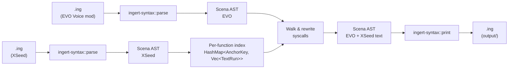
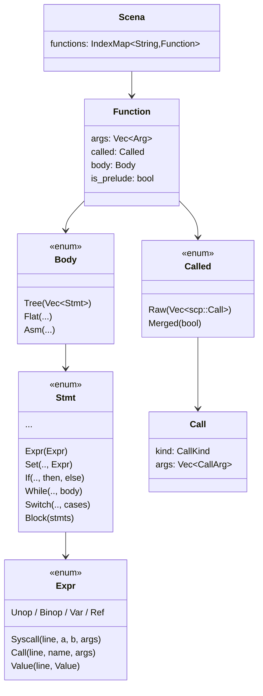
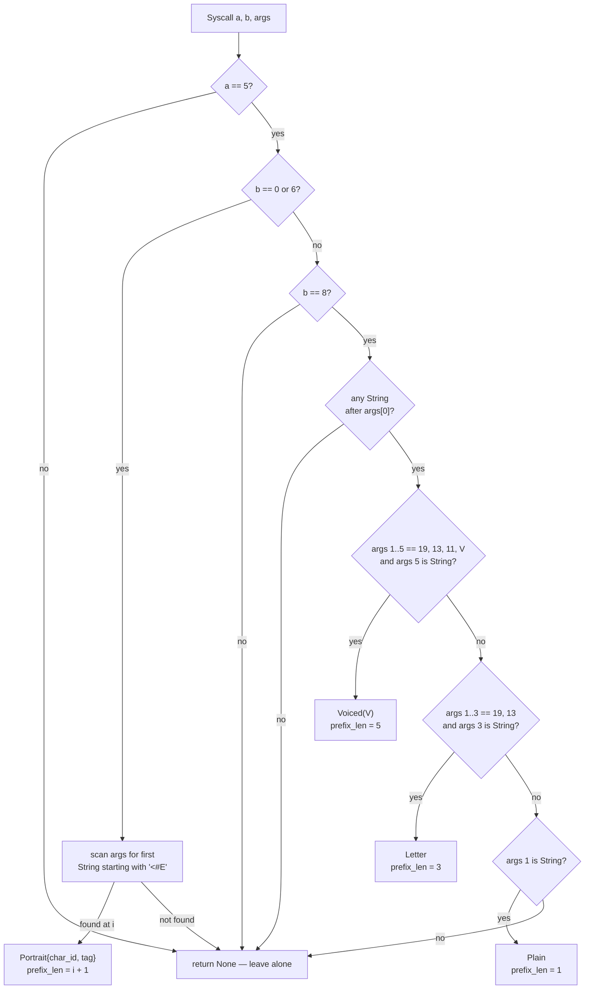
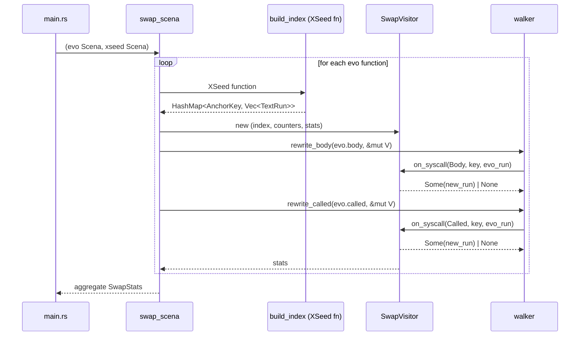
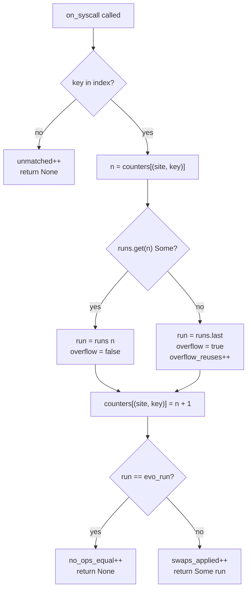

# Architecture

This document describes how `sora-remake-merge` rewrites EVO Voice mod `.ing` scripts to carry the XSeed English text. Before reading further, it is worth consulting [`AGENTS.md`](../AGENTS.md) (equivalent to `CLAUDE.md`), which covers the merge semantics: anchors, voice IDs, duplication sources, and the N-to-M rule. The present document describes the implementation that realises those semantics.

## High-level summary

For visitors who have arrived at this repository as players rather than as contributors, the short version is that this project produces a community mod which combines two existing community efforts for *Trails in the Sky: 1st Chapter*. The XSeed restoration overlay corrects the original English script, which is widely regarded as the stronger localisation, while the EVO Voice mod re-adds the voice-acted audio from the EVO edition of the game. Each project is strong in one dimension and weak in the other: XSeed has the better text but no added audio, whereas the EVO Voice mod has the audio but ships with the older, weaker GungHo translation. The role of this repository is consequently to combine the two, producing a single set of script files which carry XSeed's text on top of the EVO mod's voice hooks. Finished output lands under `output/`, and a separate Ingert step subsequently recompiles those files back to the binary `.dat` format that the game can load. For installation instructions and the download itself, see the project [`README.md`](../README.md).

The merge itself is implemented as a deliberate sequence of four stages, summarised here and elaborated in the sections that follow.

1. **Parse.** Both the EVO `.ing` script and the corresponding XSeed `.ing` script are parsed into an abstract syntax tree by the `ingert-syntax` library. Working at the AST level, rather than at the level of raw text, is essential because dialogue calls interleave text with non-text arguments (character IDs, voice cues, portrait tags), and a regex-based approach would consequently risk clobbering the very voice metadata which the merge is intended to preserve.
2. **Index.** For each function in the XSeed file, an index is constructed which maps a dialogue *anchor key* (broadly, who is speaking, with which portrait, and where applicable which voice line) to the localised text that XSeed associates with that anchor. The anchor is the lookup mechanism by which an EVO dialogue line subsequently finds its XSeed counterpart.
3. **Walk and rewrite.** The EVO file is walked function-by-function. Each dialogue syscall is classified, its anchor is looked up in the XSeed index, and where a match is found, the EVO text is replaced with the XSeed text. Voice IDs, character IDs, portrait tags, and any other non-text arguments survive unchanged. Lines that the EVO mod adds but XSeed does not contain (typically those backing newly voiced audio) are left byte-identical, thereby ensuring that the EVO mod's contributions are preserved.
4. **Print.** The transformed EVO AST is printed back to `.ing` and written under `output/`. The merge tool stops there; recompilation to `.dat` is intentionally a separate step, handled by `scripts/ing2dat.py` invoking the Ingert binary.

The pipeline is idempotent by design: running the tool a second time against its own output produces a byte-identical result, which consequently makes a re-run after a partial change always safe. While the implementation that follows leans on AST-specific terminology, the underlying intent throughout is the four-stage shape described above.

## Workspace layout

```
sora1stchapter/
├── Cargo.toml                 # workspace; pins ingert / ingert-syntax to a fork rev
├── rust-toolchain.toml        # nightly (ingert-syntax uses `never_type`)
├── resources/                 # read-only input corpora (.dat checked in; .ing gitignored)
│   ├── evo-voice-mod/         # merge target — EVO scripts (GungHo English + EVO audio)
│   ├── xseed-restoration/     # source of truth — XSeed English overlay
│   └── original/              # GungHo baseline (verification only)
├── output/                    # gitignored; merged .ing files land here
├── scripts/
│   ├── dat2ing.py             # batch `.dat` → `.ing` via ingert.exe (bootstrap)
│   ├── ing2dat.py             # batch `.ing` → `.dat` (post-merge)
│   └── prune.py               # drop corpus files with no XSeed counterpart
└── sora-remake-merge/
    ├── src/
    │   ├── lib.rs             # public surface
    │   ├── main.rs            # clap CLI, dir walking, file I/O
    │   ├── io.rs              # parse_ing / print_ing wrappers
    │   ├── anchor.rs          # AnchorKey + classify_syscall_{expr,call}
    │   ├── text_run.rs        # extract / build / replace `Vec<String>` runs
    │   ├── walker.rs          # AST walker + Visitor trait (body and called)
    │   └── swap.rs            # swap_scena, per-function index, SwapVisitor
    └── tests/e2e.rs           # roundtrip / corpus-based integration tests
```

The merge crate is structured as a single binary which re-exports its library, thereby allowing integration tests to drive `swap_scena` directly without spawning a separate process.

## High-level data flow



The pipeline is, fundamentally, a pure AST transformation: there is no regex involvement, no string-level patching, and no fuzzy matching. Consequently, the parser and printer from the [`ingert-sora1` fork](https://github.com/kvnxiao/ingert-sora1) are the only components that need to know the surface syntax.

## Why an AST pipeline (and why Rust)

Two factors make a regex-based approach a non-starter.

- **Voice IDs are integer arguments mixed in with text arguments.** In `system[5,0](134, 11, 33247, "<#E…>", "text")`, the `11, 33247` pair is positional rather than labelled. A textual rewrite would consequently have to count commas correctly across both EVO-original voice IDs (e.g. Lugran `33247`) and EVO-mod-added ones (e.g. Joshua `60589`). The AST, in contrast, provides typed `Expr::Value(_, Value::Int(_))` versus `Expr::Value(_, Value::String(_))` distinctions for free.
- **Text spans multiple string arguments.** EVO and XSeed split long lines differently (`"X"` versus `"X", 10, "Y"`). The swap must therefore replace the *entire trailing string run* as a unit, rather than aligning string-for-string.

The Rust toolchain pays off in three respects: the parser and printer already exist as a library; the AST types render it impossible to clobber a voice ID by accident, since `Vec<Expr>` indexing is typed; and the parse → transform → print cycle is naturally idempotent.

## The `.ing` AST in one picture



Two parallel argument families carry text:

- `Body::Tree(Vec<Stmt>)` is where runtime control flow lives. Dialogue calls appear as `Expr::Syscall(_, 5, 0|6|8, Vec<Expr>)`.
- `Called::Raw(Vec<Call>)` is the called-table metadata block (the first `{ }` after `calls`). Dialogue calls appear as `Call { kind: CallKind::Syscall(5, 0|6|8), args: Vec<CallArg> }`.

The two are structurally equivalent for our purposes (same opcode space, same argument layout), although they are built from different ingert types (`scena::Value` versus `scp::Value`). The merge tool consequently walks both with identical logic.

Since `dat2ing.py` always invokes `ingert.exe --mode tree`, the `Body::Flat` and `Body::Asm` variants, along with `Called::Merged`, are corner cases that the swap layer handles defensively but rarely encounters in practice.

## Module responsibilities

### `anchor.rs`: opcode → key

`classify_syscall_expr` and `classify_syscall_call` are mirror functions, both delegating to a generic implementation parameterised over `as_int`, `as_string`, and `is_string` closures. Each returns an `Option<Classification>`:

```rust
pub enum AnchorKey {
    Portrait { char_id: i32, tag: String },  // [5,0] and [5,6]
    Voiced(i32),                              // [5,8]-voiced — strongest anchor
    Letter,                                    // [5,8]-letter — positional within fn
    Plain,                                     // [5,8]-plain  — positional within fn
}

pub struct Classification {
    pub key: AnchorKey,
    pub prefix_len: usize,  // args[..prefix_len] is the immutable prefix
}
```

The classifier returns `None` for unsupported opcodes, named-function calls, and `[5,8]-params` (the no-string variant); every caller subsequently treats that as a signal to leave the call alone.



`prefix_len` is the only piece of information the swap layer requires concerning the call's prefix. Everything preceding that index is untouchable; everything from that index onward constitutes the text run.

### `text_run.rs`: `Vec<String>` ↔ args

Three operations, each implemented twice (an Expr-flavour and a CallArg-flavour):

- `extract_run_{expr,call}(&[…]) -> Option<Vec<String>>`: peels alternating `String` and `Int(10)` arguments. It returns `None` on a shape mismatch, which signals that the call is not a text run and should be left alone. Line annotations on string arguments are dropped.
- `build_run_{expr,call}(&Vec<String>) -> Vec<…>`: the inverse operation. It joins strings with `Int(10)`, and importantly **never** stamps `Line` annotations on the new arguments, thereby ensuring that injected XSeed strings come out clean.
- `replace_run_{expr,call}(&mut Vec<…>, prefix_len, &new_run)`: truncates the argument list after the prefix and appends the rebuilt run.

The asymmetry (extract drops annotations, build does not add them) is deliberate. It thereby guarantees idempotency: parse → transform → print → parse → transform yields the same AST.

### `walker.rs`: AST traversal and the `Visitor` trait

```rust
pub enum Site { Body, Called }

pub trait Visitor {
    fn on_syscall(
        &mut self,
        site: Site,
        key: &AnchorKey,
        evo_run: &TextRun,
    ) -> Option<TextRun>;  // Some(new) → swap; None → leave alone
}

pub fn rewrite_body(stmts: &mut [Stmt], visitor: &mut impl Visitor);
pub fn rewrite_called(calls: &mut [Call], visitor: &mut impl Visitor);
```

`rewrite_body` recurses through every `Stmt` variant capable of holding expressions, which includes both branches of `If`, every `Switch` arm, nested `Block`s, `While` bodies, the RHS of `Set`, the payloads of `Return` and `PushVar`, and the argument lists of `Debug` and `Tailcall`. Each `Expr::Syscall` is classified, the trailing run is extracted, and the visitor is consulted on whether to perform a swap. A visitor returning `Some(new)` consequently triggers `args.truncate(prefix_len); args.extend(build_run_expr(&new))`.

`rewrite_called` walks `Called::Raw` calls in order, applying the same logic on `CallArg` values.

The visitor pattern constitutes the seam between *walking* and *swapping*. Tests exercise the walker against a counting visitor, whereas production wires in `SwapVisitor`.

### `swap.rs`: the index and `SwapVisitor`

`swap_scena` is the public entry point. It iterates over EVO functions, looks up each by name in the XSeed `Scena`, builds an index from that XSeed function, and runs the visitor over EVO's body and called-table.

```rust
type Index = HashMap<AnchorKey, Vec<TextRun>>;
```

The index is constructed **per function, rather than per file**. Anchors only collide within the scope of a single function (i.e. the same character speaking with the same portrait), so a per-function map is sufficient and avoids cross-function false matches.



#### N-to-M matching

The same anchor key frequently appears multiple times within a function, both as a consequence of `calls{} {}` duplication and because of first-visit and revisit branches within the code body. To handle this, `SwapVisitor` maintains a per-`(Site, AnchorKey)` counter and indexes into the `Vec<TextRun>` corresponding to that key:



Counters are partitioned by `Site` so that the called-table walk and the body walk each receive a fresh sequence; this reflects the fact that the metadata duplicates the body, and the two consequently consume the same XSeed runs in the same order.

The overflow rule (reuse the last XSeed run when EVO has more occurrences than XSeed) is the deliberate concession to the calls/body × first-visit/revisit multiplicity described in `AGENTS.md`. While this rule may be less precise than a strict one-to-one mapping, in practice it correctly handles the duplication patterns observed across the corpus.

#### `Called::Merged` and non-`Tree` bodies

- `Called::Merged(_)`: the called-table is `dup`-equivalent to the body. The body walk has already covered it, so the swap layer skips the called walk in this case.
- `Body::Flat(_)` and `Body::Asm(_)`: these never appear in tree-mode decompiles, but should they ever do so, the swap layer leaves the body alone and indexes from the called-table instead, thereby ensuring the function is not silently dropped.

### `io.rs`: parser and printer adapters

Thin wrappers over `ingert_syntax::{lex, parse, print}`. `parse_ing` aggregates `Errors` at `Error` severity or worse into a `ParseError` with line-resolved messages. `print_ing` is `ingert_syntax::print::print` re-exported.

The principal reason the workspace pins to a fork revision is that **the upstream Ingert printer was not stable on these inputs** (specifically `mp0010_05.ing`). The integration tests consequently pin both behaviours:

- `evo_mp1010_04_roundtrip_stable` and `evo_mp0010_05_roundtrip_stable`: assert that `print(parse(s)) == print(parse(print(parse(s))))`.
- `mp0010_05_output_recompiles_via_ingert`: verifies that, after a swap, `ingert.exe` accepts the printed `.ing` back as input.

Should the printer regress, the fix should be applied in the [`ingert-sora1` fork](https://github.com/kvnxiao/ingert-sora1), pushed, and the `rev` field bumped in the workspace `Cargo.toml`. The fork remote (`fork → git@github.com:kvnxiao/ingert-sora1.git`) lives at `C:/Users/kvnxiao/github/Ingert/`.

### `main.rs`: the CLI

```
sora-remake-merge                                       # defaults to resources/* + output/
sora-remake-merge --evo <path> --xseed <path>           # file or dir
sora-remake-merge --out <path>                          # override output destination
sora-remake-merge --dry-run                             # parse + compute, no writes
sora-remake-merge --verbose                             # per-file swap counts
```

Directory mode walks `--evo` recursively with `walkdir`, filters to `.ing`, mirrors the relative path under `--xseed` and `--out`, and aggregates per-file `SwapStats`. EVO files which lack an XSeed counterpart are skipped (and counted under `files_missing_xseed_skipped`). The tool never mutates inputs.

## Supported opcodes (reference table)

| Opcode | Shape | Anchor | Prefix |
|---|---|---|---|
| `[5,0]` | `(char_id, [voice_ids…], "<#E…>", ["<K>" \| "<k>",] strings…)` | `Portrait{char_id, tag}` | through the `<#E…>` arg |
| `[5,6]` | same as `[5,0]` (voiced/continuation variant) | `Portrait{char_id, tag}` | through the `<#E…>` arg |
| `[5,8]-voiced` | `(65535, 19, 13, 11, V, strings…)` | `Voiced(V)` | through `11, V` |
| `[5,8]-letter` | `(65535, 19, 13, strings…)` | `Letter` (positional) | through `19, 13` |
| `[5,8]-plain` | `(65535, strings…)` | `Plain` (positional) | through `char_id` |
| `[5,8]-params` | `(65535, 16, …, 17, …, …)` — no strings | — | skipped |
| anything else | — | — | skipped |

`Voiced` is the only `[5,8]` key that carries a uniquely identifying anchor; `Letter` and `Plain`, by contrast, rely on counter-based position-matching within the same function. It is worth noting that `[5,8]-voiced` IDs have been verified across the corpus to be stable between `original/`, `xseed-restoration/`, and `evo-voice-mod/`.

## Idempotency

A second invocation on the output of the first is a byte-identical no-op. Three behaviours enforce this property:

1. `extract_run_*` drops `Line` annotations, while `build_run_*` never adds them; consequently, an already-rewritten string run extracts identically to the index entry.
2. `on_syscall` compares `run == evo_run` and returns `None` on equality, thereby leaving the AST structurally unchanged when the text already matches.
3. The walker only rewrites `args` when the visitor returns `Some(new_run)`. No `Some(_)` consequently means no `Vec::truncate`, which in turn means no AST churn.

These behaviours are covered by `swap::tests::idempotent_second_run_is_noop` and the e2e `idempotent_mp{0010_05,1010_04}` tests.

## Test surface

Unit tests live next to each module (`#[cfg(test)] mod tests`). Integration tests in `tests/e2e.rs` drive the library entry point against real corpus files:

- **Parser/printer roundtrip stability** on `mp1010_04.ing` and `mp0010_05.ing` (both EVO and XSeed).
- **The three documented `mp1010_04.ing` examples**: Lugran "Yes, from Aina" → XSeed wording, Joshua jurisdictional disputes, and Estelle General Morgan. Each test asserts that the XSeed text is present, the EVO text is absent, and the EVO voice IDs (`33247`, `60589`, `60593`) survive.
- **Cassius letter `[5,8]-voiced`**: voice IDs `34832..=34844` survive verbatim, and XSeed's quoted style replaces EVO's.
- **Idempotency at file level** on both `mp1010_04.ing` and `mp0010_05.ing`.
- **`resources/` read-only invariant**: both XSeed and `original/` files hash identically before and after a swap.
- **`ingert.exe` recompile**: the `.ing` output from a swap recompiles back to `.dat` via the fork's binary. This test is gated on the `INGERT_EXE` environment variable, and is the test that would catch a printer-versus-compiler drift.

The recompile and roundtrip tests assume that the `.ing` fixtures have been regenerated (the `.ing` files are gitignored, while only `.dat` is checked in). Running `python scripts/dat2ing.py resources/<corpus>` bootstraps them.

## Workflow summary

1. `python scripts/dat2ing.py resources/{evo-voice-mod,xseed-restoration,original}`: bootstrap the `.ing` fixtures.
2. `cargo run --release -- --verbose`: run the merge against the defaults, with output landing in `output/`.
3. `python scripts/ing2dat.py output/script_en/scena`: recompile to game-loadable `.dat`.

The merge tool stops at step 2. Recompilation is intentionally a separate Ingert invocation.

## Out of scope

- Recompiling `.ing` → `.dat` (handled by `ingert.exe` and `scripts/ing2dat.py`).
- Fuzzy text matching, or any heuristic beyond exact `AnchorKey` equality. Unmatched calls consequently stay byte-identical.
- Interactive prompts, partial-merge modes, or any UI. The tool is designed to run once and either succeed or fail loudly.
- Opcodes beyond `[5,0]`, `[5,6]`, and `[5,8]`. Should a new localised opcode appear, the classifier and tests would need to be extended in tandem.
